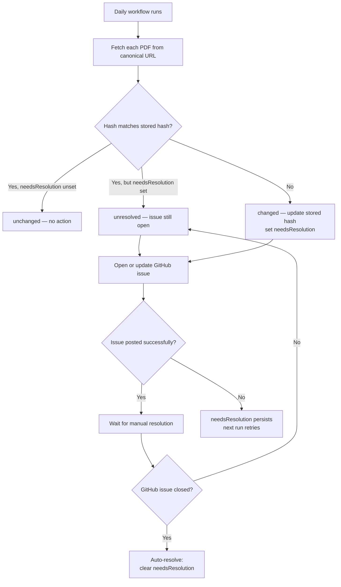

import { Steps } from '@astrojs/starlight/components';

Government forms change without notice. Namesake runs an automated monitor daily to detect when a PDF at its canonical source URL has changed, so contributors can review and update the local copy before users fill it out with stale fields.

## How it works

Every day, a scheduled GitHub Actions workflow fetches each PDF that has a `canonicalUrl` defined and compares it against the last known hash. If anything has changed, a GitHub issue is opened automatically.



### Statuses

| Status | Meaning |
|---|---|
| `unchanged` | Hash matches; no action needed |
| `new` | First time this PDF has been seen |
| `changed` | Hash differs from last scan; issue will be opened |
| `unresolved` | Hash matches, but a prior change hasn't been resolved yet |
| `unverifiable` | Server returned 403; can't check this PDF |
| `error` | Network or fetch failure |

### Silent failure protection

When a change is detected, the new hash is saved immediately so future changes to the same PDF can still be caught. Alongside it, a `needsResolution` flag is written to the history. This flag keeps the PDF marked as `unresolved` on every subsequent run — even after the hash stabilizes — until the GitHub issue is explicitly resolved. If the issue-posting step fails for any reason, the flag persists and the next run will retry.

## Responding to a PDF change

When the monitor opens a GitHub issue, someone needs to:

<Steps>

1. **Download the new PDF** from the canonical URL listed in the issue.

2. **Compare it to the version in `web/src/content/pdfs/`.**

   Check whether any fields were added, removed, or renamed. Pay attention to field names, types, and ordering.

3. **Update the local copy** if the new version includes meaningful changes.

   Replace the PDF file and re-run the PDF Manager to regenerate `schema.ts`. Review the resolver in `index.ts` to make sure all fields still map correctly.

   :::note
   If the PDF changed only cosmetically (e.g. updated branding, reworded instructions) with no field changes, no update to `index.ts` or `schema.ts` is needed — just replace the file.
   :::

4. **Open a pull request** with your changes.

5. **Close the GitHub issue** once the PR is merged.

   Closing the issue signals to the monitor that the change has been reviewed. The next scheduled run will detect the closed issue and automatically clear the `needsResolution` flag.

</Steps>

## Resolving manually

If you need to clear the unresolved state without waiting for the next scheduled run — for example, after confirming a false positive — you can resolve locally:

```zsh
# Resolve all pending PDFs
pnpm pdf:resolve

# Resolve a specific PDF by ID
pnpm pdf:resolve cjp27-petition-to-change-name-of-adult
```

This writes a new history entry with `needsResolution` cleared. Commit the updated `.pdfmonitor/` cache file so the change takes effect in CI.

## Running the monitor locally

```zsh
pnpm pdf:monitor
```

This fetches all PDFs with a `canonicalUrl`, compares hashes, and prints a status for each. It exits with a non-zero code if any PDFs are `changed` or `unresolved`, matching CI behavior.
