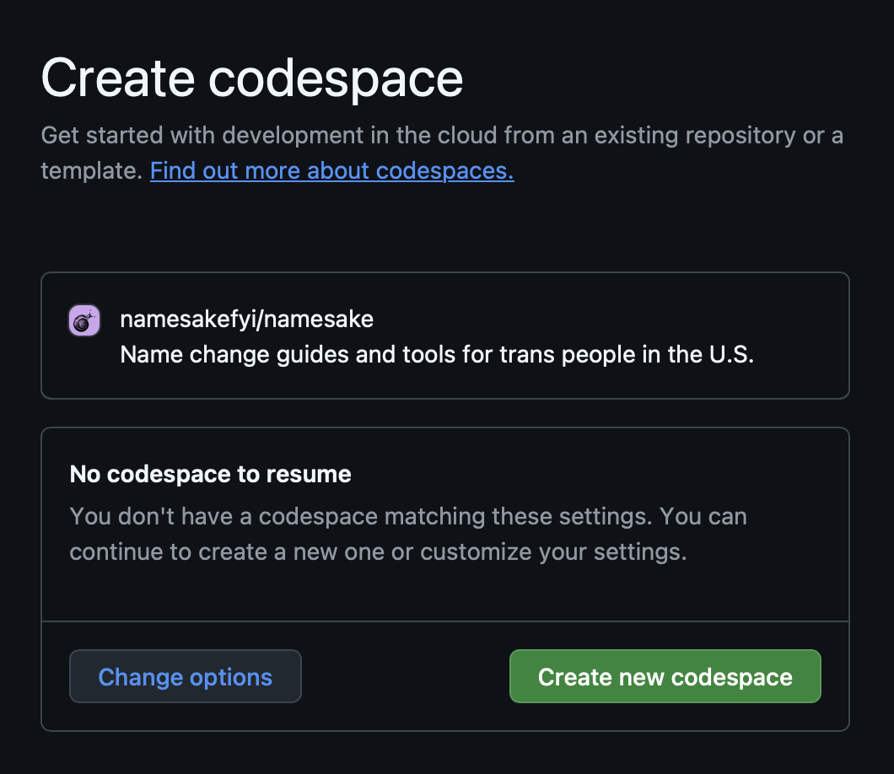

import { Steps } from '@astrojs/starlight/components';


To get started making edits to the Namesake website, the [automatic setup](#automatic-setup) will allow you to make edits in your web browser via GitHub Codespaces. To use your own preferred editor and terminal, follow the [manual setup](#manual-setup).

:::note
You will need a [GitHub](https://github.com) account to contribute. Sign up for free and verify your email address before continuing.
:::

## Automatic setup

GitHub Codespaces gives you a ready-to-go copy of Namesake, running in your browser, with a code editor and a live preview of the website. It is the easiest way to get started.

Create a new codespace by clicking this button:

[](https://codespaces.new/namesakefyi/namesake?quickstart=1)

If you've opened a codespace before, you'll be given the option to resume your existing one. If this is your first time, you will need to create a new one: click **Create new codespace**.



:::tip
The link [namesake.fyi/edit](https://namesake.fyi/edit) does the same thing as the button above: it will open up Codespaces, defaulting to your most recent one.
:::

Wait for everything to load. The first time can take a few minutes. When it's ready, a preview of the Namesake website will open in a panel next to the editor. Hooray! You are now running your own unique copy of the Namesake site.

<details>
  <summary>I get a message: "Do you trust the authors of the files in this folder?"</summary>
  Click "Trust Folder & Continue". Because we run a terminal command at startup to automatically show the website preview, GitHub shows a warning.
</details>

### Make a change

<Steps>

1. Create a new branch.

   In the bottom left corner of the editor, click the branch name (`main`). Choose **Create new branch...**, then type a short name describing your change, like `update-oregon-guide`, and press `enter`.

2. Find the file you want to edit.

   Press `Ctrl + P` (or `Cmd + P` on a Mac) and start typing the name of the page. Most writing lives in the `web/src/content` folder. For example, name change guides are in `web/src/content/guides`.

3. Make your edits.

   Your changes are saved automatically, and the website preview will refresh to show them.

</Steps>

### Propose your changes

<Steps>

1. Commit your changes.

   On the left side of the editor, click the **Source Control** icon (it looks like a branching line). Type a short message describing what you changed, then click **Commit**.

   If you're asked whether to stage your changes, click **Yes**.

2. Publish your branch.

   Click **Publish Branch**. Since you don't have permission to edit the main Namesake repository, you'll be asked whether to create a fork. Click **Create Fork**.

   <details>
     <summary>What's a fork?</summary>
     A fork is your own copy of the Namesake repository. Your changes are saved to your fork, and then you propose merging them back into Namesake with a **pull request**.
   </details>

3. Open a pull request.

   Go to your fork on GitHub (`https://github.com/MY_USERNAME/namesake`). Click **Compare & pull request**, describe your changes, then click **Create pull request**.

</Steps>

Within a few minutes, a preview link will be added to your pull request so that others can see your changes. A Namesake team member will review your changes and may leave feedback.

### Come back later

To make more changes, including responding to feedback on your pull request, go to [namesake.fyi/edit](https://namesake.fyi/edit) and resume your existing codespace. Make your edits, then commit and click **Sync Changes**. Your pull request will update automatically.

When your pull request is merged, you can delete your codespace from [github.com/codespaces](https://github.com/codespaces) to free up storage.

## Manual setup

### Prerequisites

Before you get started, you will need:

1. A terminal (Terminal.app, [Ghostty](https://ghostty.org), Windows Terminal, etc.).
2. A code editor such as [VS Code](https://code.visualstudio.com) or [Zed](https://zed.dev).
3. [Node.js](https://nodejs.org/en/download) installed on your computer.
4. [pnpm](https://pnpm.io/installation) installed on your computer.

Follow the steps for each of these if they are not already installed.

### Fork and clone the repository

<Steps>

1. Fork the repository.

   Click the "Fork" button on the top right of the [`namesake` repository](https://github.com/namesakefyi/namesake/) to create your own copy of the repository.

   <details>
     <summary>Why do I have to do this?</summary>
     The `namesakefyi/namesake` repository only allows people on the Namesake core team to create new branches and push changes. In order to propose changes, **you need to make edits on your _own_ copy** ("fork") of the repository. Once you've made your changes, you propose merging them back into the main repository with a **pull request**.
   </details>

2. Clone your fork.

   Open your terminal and paste this line (updating `MY_USERNAME` to your own GitHub username), then press `enter` to run it:

   ```shell
   git clone https://github.com/MY_USERNAME/namesake.git
   ```

</Steps>

You should now have a `namesake` folder on your computer. Open the folder in your code editor and take a look around!

### Start the development server

<Steps>

1. Navigate to the `namesake` directory from your terminal, then install packages.

   ```bash
   cd namesake
   pnpm install
   ```

   <details>
     <summary>I'm getting `error command not found: pnpm`</summary>
     You need to install `pnpm`, the package manager we use. Follow the `pnpm` [installation guide](https://pnpm.io/installation). If you get stuck, reach out on Discord!
   </details>

   If this is your first time installing packages, it may take awhile to download everything. 

   :::tip
   Run `pnpm install` whenever you pull new changes from GitHub.
   :::

2. Start the development server.

   ```bash
   pnpm dev
   ```

</Steps>

You should now be able to see the Namesake website at [http://localhost:4321](http://localhost:4321)! Changes will automatically refresh in your browser as you edit and save the code.

Leave this process running in the background while you work on the codebase. To stop the server, press `Ctrl + C` in the terminal.

Congrats! You are ready to develop on the Namesake codebase.
