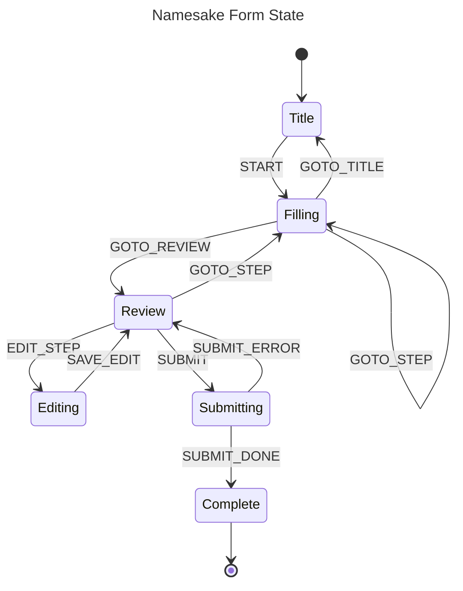

Multi-step forms can get complicated _fast_. Conditional visibility, validation logic, and routing must all be handled correctly. If poorly planned, large forms can quickly devolve into a tangled mess of spaghetti code.

To manage this complexity, Namesake implements a [finite-state machine](https://en.wikipedia.org/wiki/Finite-state_machine) to ensure that a form can be in exactly **one** of a finite number of states at any given time. Changes from one state to another are handled through pre-determined **transitions**.

## States

Each form's state is managed using [XState](https://xstate.js.org). The user begins in the `title` state, transitioning to various other states until they reach `complete`.

| State | What the user sees |
|---|---|
| `title` | Cover page with form info and a "start" button |
| `filling` | Individual questions |
| `review` | Summary of all answers |
| `editing` | A single step reopened from the review page |
| `submitting` | Loading state while PDFs are generated |
| `complete` | Success page with options to redownload or restart |

The state machine also stores `context` for the `formSlug`, `currentStepId`, and `editingStepId`.

:::note

On its own, the state machine doesn't "know" about any of the values the user enters in the form. It only manages the overall flow.

:::

## Visible fields and steps

As the user progresses through the form, they will enter data which affects the visibility of other fields and steps. To make sure we are displaying the correct fields on the review table and writing the correct data to the final PDF, visibility must be **resolved**.

The [`resolveFormVisibility`](https://github.com/namesakefyi/namesake/blob/main/src/lib/forms/formVisibility.ts#L82) function  takes an input of `steps`, user `formData`, and `pdfs`, and parses the visibility rules. It returns:

- `visibleStepIds` — steps not excluded by `when` predicates
- `visibleFields` — field values for visible fields only
- `sections` — per-step arrays of visible field names (used to section the review table into scannable chunks)
- `pdfsToInclude` — which PDFs to include based on their `when` predicates

## Persistence

Forms can be lengthy, so it's important to save a user's progress as they go. Field values and form progress are automatically saved to IndexedDB in the `formProgress` table. A form that is closed and reopened will resume where it left off.
