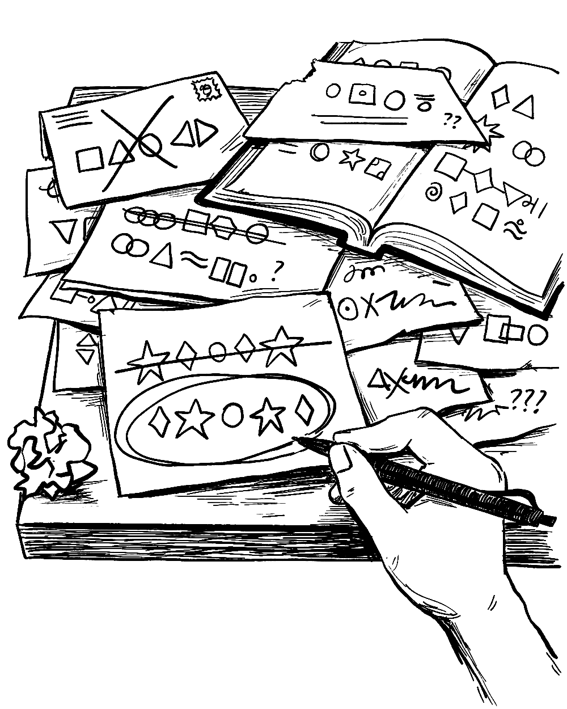
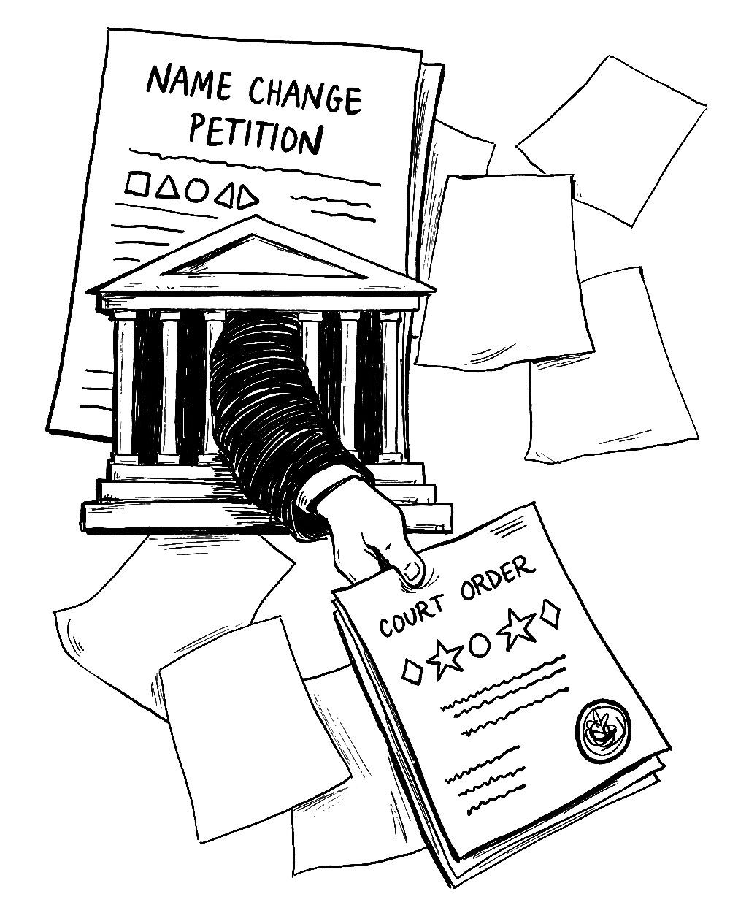

## Choose a name

What name suits you? Maybe you already know, or maybe you need time to experiment. Find your own pace.

[Behind The Name](https://www.behindthename.com/) is a helpful database of first names which allows filtering by gender, usage, mythology, and other keywords. They also have a fun [random name generator](https://www.behindthename.com/random/) which can help when exploring ideas.

*All illustrations by [Kit Mills](https://mitkills.com/).*

## File a court petition

Once you've decided on a name, you'll submit a court petition in your state. We'll help you fill out required [forms](https://namesake.fyi/forms).

## Update other documents

We recommend starting with [Social Security](/guides/social-security), followed by your State ID, Driver's License, and [Passport](/guides/passport).

## Live your life

You've always been you, but now it's official. Take a moment to celebrate. :)

![Two hands reach out to each other, and speech bubbles read, 'Hey, I'm [a collection of shapes representing the new name].' A response bubble reads, 'Nice to meet you'. On the bottom hand, there is a small snail.](./images/live-your-life.png)
