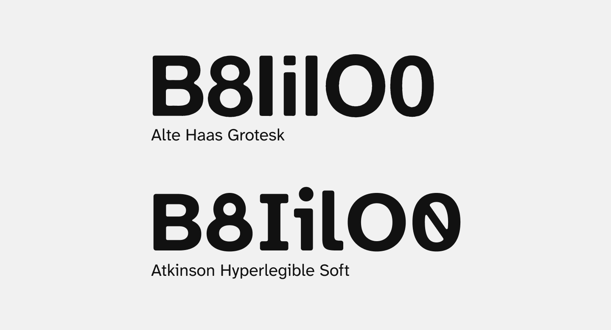

The choice of font for a website may seem like a small decision, but we care deeply about making Namesake accessible to the widest range of people possible.

Our previous font, [Alte Haas Grotesk](https://www.dafont.com/alte-haas-grotesk.font), had the style we wanted, but some of its letterforms were overly-similar: for example, uppercase ‘I’ and lowercase ‘l’  could be easily confused. (Typographic clarity is absolutely essential when filling out documents to determine the exact spelling of a new name!) It also lacked _italics_, making it difficult for us to emphasize text without resorting to **bold**.

[Atkinson Hyperlegible](https://www.brailleinstitute.org/freefont/) is a font designed in 2019 for the Braille Institute which prioritizes letterform distinction and clarity. It was designed specifically for low-vision readers in order to help distinguish between similar letterforms. We thought it would make a great fit for Namesake, but we also wanted to make it _ours_.

Graciously, Atkinson Hyperlegible is published under a permissive [Open Font License](https://openfontlicense.org/), allowing us to modify it to suit our needs.

Namesake now uses a customized version of Atkinson we’ve published as [Atkinson Hyperlegible Soft](https://github.com/namesakefyi/atkinson-hyperlegible-soft). Our soft version features the same distinct letterforms as Atkinson Hyperlegible, but with rounded corners to emulate printed text that fits [Namesake’s style](https://namesake.fyi/brand-assets). We like it, and hope you will too!

You can [download Atkinson Hyperlegible Soft via GitHub](https://github.com/namesakefyi/atkinson-hyperlegible-soft/releases/latest).

---

An enormous thanks to the original designers of Atkinson Hyperlegible: [Applied Design](https://helloapplied.com/) ([Elliott Scott](http://www.mondayne.com/), [Megan Eiswerth](https://www.instagram.com/meganeisdesign/), and [Theodore Petrosky](https://fontsinuse.com/type_designers/9035/theodore-petrosky)), [Linus Boman](https://timesnewboman.com/), and [Letters from Sweden](https://lettersfromsweden.se/).

If you enjoy using this font, please consider donating to support the [Braille Institute](https://www.brailleinstitute.org/give/).
