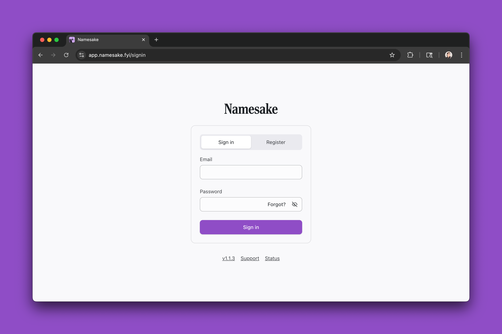
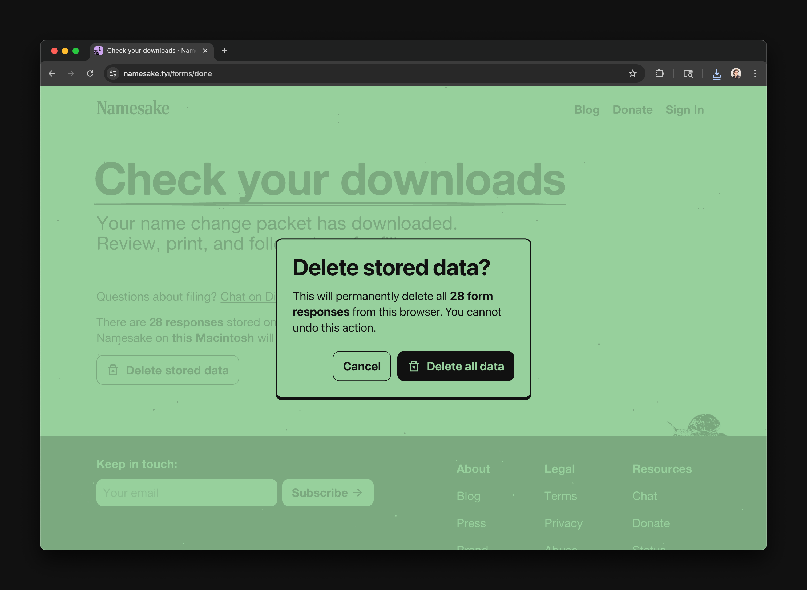

**Sometimes, in an effort to improve things, you accidentally erect new barriers.** We launched a web application last year [to assist trans people with the legal name change process](/blog/easier-legal-name-changes-for-all), and so far, our app has helped around 100 people in Massachusetts. But when navigating to Namesake's app for the first time—to get information about the court order process, or about passport news, or anything else—this is what you'd see:

It was impossible to preview Namesake's forms or read any of our guides without first sharing an email and password. In a process already full of so many burdens, it felt wrong for Namesake to ask for even more.

Our goal for Namesake is to make name changes as accessible as possible. To that end, we've torn down the [login wall](https://www.nngroup.com/articles/login-walls/)—in fact, we're eliminating user accounts entirely. All of our guides, forms, and other information have been relocated onto public, sharable webpages.

## What's changed

### Namesake no longer requires an account

All content previously available on [app.namesake.fyi](https://app.namesake.fyi) has been relocated to the main Namesake website, publicly-viewable at [namesake.fyi/forms](https://namesake.fyi/forms) and [namesake.fyi/guides](https://namesake.fyi/guides).

Now, anyone can link directly to a resource (like our [Massachusetts Court Order](/forms/court-order-ma) form) and immediately begin reading and filling out information. No unhelpful login screens; no email required.

### User form data is now stored locally

Namesake has never had access to (or wanted access to) user data—we took care to end-to-end encrypt all responses to our previous forms when storing them.

With the move away from logins, we've gone one step further: **all form data is now stored locally and never leaves your device.** This means you could, if you wanted, download the Namesake website and use it to fill out and download PDFs entirely offline!

All information is processed on-device, and users are given the opportunity to delete their data immediately after filling a form. We're really excited about this technical change; it means less infrastructure for us to manage, and more control in your hands.

### Forms have been redesigned to encourage focus and avoid errors

Namesake's forms have been redesigned.

The first screen for a form will now give an overview of what to expect, including the list of documents which are included in the final packet, the time we estimate it'll take to complete the form, and the date the form was last revised.

![Court Order: Massachusetts. If you live in Massachusetts and want to legally update your name, this is the place to start. Massachusetts no longer requires publishing name change in a newspaper as of November 26, 2025. All name change records will now be kept confidential without having to file additional paperwork. Read more about the passage of MA Senate Bill 1045 and House Bill 1673, "An Act Protecting Personal Security".  This form helps you fill out name change documents, including: Petition to Change Name of Adult (CJP-27) Court Activity Record Request Form (CJP-34) Affidavit of Indigency Takes about 5–11 minutes. We’ll provide guidance for common questions. Responses are securely stored in Chrome on this Apple Macintosh. For security, your information never leaves this device.](./content-d44fb72e1fa2.png)

Instead of displaying all questions in a single, scrolling page, we've split questions into [one thing per page](https://www.smashingmagazine.com/2017/05/better-form-design-one-thing-per-page/). This form design method is proven to increase completion rates and minimize errors.

Finally, a brand-new review screen at the end of the form allows double-checking responses before download.

Once the form is downloaded, you'll be given the opportunity to clear all submitted data from the browser—particularly helpful if viewing on a shared device like at a public library.

### The old app will shut down on March 31

**The Namesake application at [app.namesake.fyi](https://app.namesake.fyi) will be sunset on March 31, 2026. All existing user accounts and data associated with that app will be permanently erased.** **New user registration for app.namesake is now closed.** **All existing content has been relocated to [namesake.fyi/forms](https://namesake.fyi/forms) and [namesake.fyi/guides](https://namesake.fyi/guides).** If you have questions, please email the team at [hey@namesake.fyi](mailto:hey@namesake.fyi).

## Less time coding, more time helping

Behind-the-scenes, we're now managing all of our content—forms, guides, and blog posts—in one place, making it easier for us to publish, cross-link resources, and keep information up-to-date.

Without needing to manage auth and storage, we can devote more time to supporting trans people instead of building undifferentiated technology. We hope it helps you.

---

**Working on your legal name change in Massachusetts?** View our (public!) [guides](https://namesake.fyi/guides) and [forms](https://namesake.fyi/forms) and get peer support [in Discord](https://namesake.fyi/chat).

**Want to help Namesake support more states?** [Donate](https://namesake.fyi/donate) or email us at [hey@namesake.fyi](mailto:hey@namesake.fyi), or contribute to our [open source codebase](https://github.com/namesakefyi).
