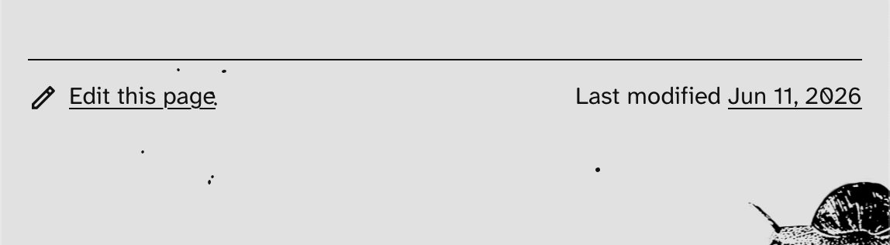

## Namesake now supports Rhode Island

Great news: residents of Rhode Island can now get support through Namesake for filling out their name change documents. Get help with [filing your court order](/guides/ri/court-order), updating your [state ID or driver's license](/guides/ri/state-id), and amending your [birth certificate](/guides/ri/birth-certificate).

Namesake started in [Massachusetts](/guides/ma), and Rhode Island is the first new state to be added. A colossal thanks to Jinwoo Pang at [Project WEBER/Renew](https://weberrenew.org), who helps organize name change clinics in Rhode Island and reached out to offer to assist Namesake. We couldn't have published these new guides and forms without her insights and advice. Thank you, Jinwoo!

[Browse Namesake's Rhode Island guides.](/guides/ri)

If you help support legal name changes in another state and want to collaborate with Namesake, email us at [hey@namesake.fyi](mailto:hey@namesake.fyi).

## Local content management and a faster site

Behind the scenes, we've been organizing to make it easier for external contributors to get involved with Namesake.

Previously, all of our guides were managed in an external content management system called Sanity. While this worked well for the Namesake core team, it made it difficult for other contributors to help revise content.

The goal of Namesake has always been a communal, wiki-style reference: guides by trans people, for trans people, to explain how to navigate U.S. bureaucracy.

In the spirit of [tearing down the login wall](/blog/no-login-wall), we've relocated all of our content out of Sanity and into the [Namesake repository](https://github.com/namesakefyi/namesake) itself. This lets all of our content be managed and updated alongside our code.

In addition, we added links to the bottom of each [guide](/guides) to quickly edit the page, see the last modified date, and access the full page history.

A happy consequence of eliminating the CMS is that **namesake.fyi is now noticeably faster!** Because we no longer need to fetch content from an external server, all of our pages are built statically, which makes page loads nearly instant.

## The Namesake Contributor Manual

As part of making it easier for contributors to get involved, we launched the [Namesake Contributor Manual](https://docs.namesake.fyi)—a documentation site that details how Namesake organized, how to set up a developer environment, and how to do common tasks like adding PDFs or editing guides.

If you've ever wanted to help Namesake but didn't know where to start, now's a great time to get involved. [Check out the docs.](https://docs.namesake.fyi)

## Fundraising for Pride

Finally, as part of Pride Month, Namesake is fundraising.

We want to support more trans people in more states, and we do this by working with local and regional LGBTQ+ non-profits and legal orgs to make sure that every guide is clear, accurate, and anticipates common questions that may arise. We’re aiming to raise money to help offset our expenses for site hosting, payment for contributors, and to ensure that everything we build remains open source and ad-free.

All of our contributors work on Namesake "on the side" from other jobs, so any donation truly goes a long way to make this work possible.

[Help Namesake support name changes in more states.](https://www.every.org/namesake/f/help-simplify-name-changes)

Happy Pride from all of us at Namesake.
