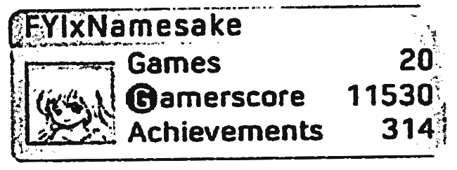
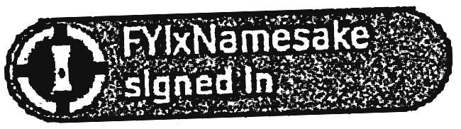
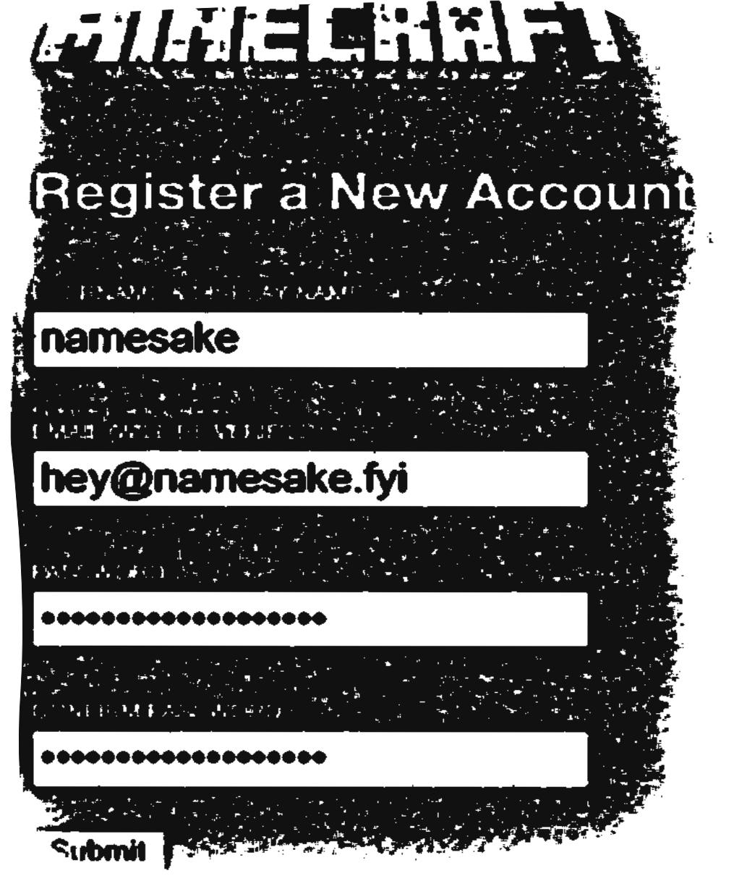
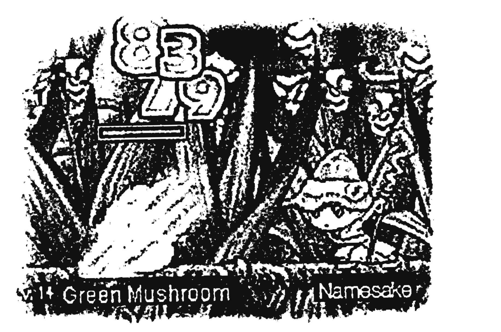
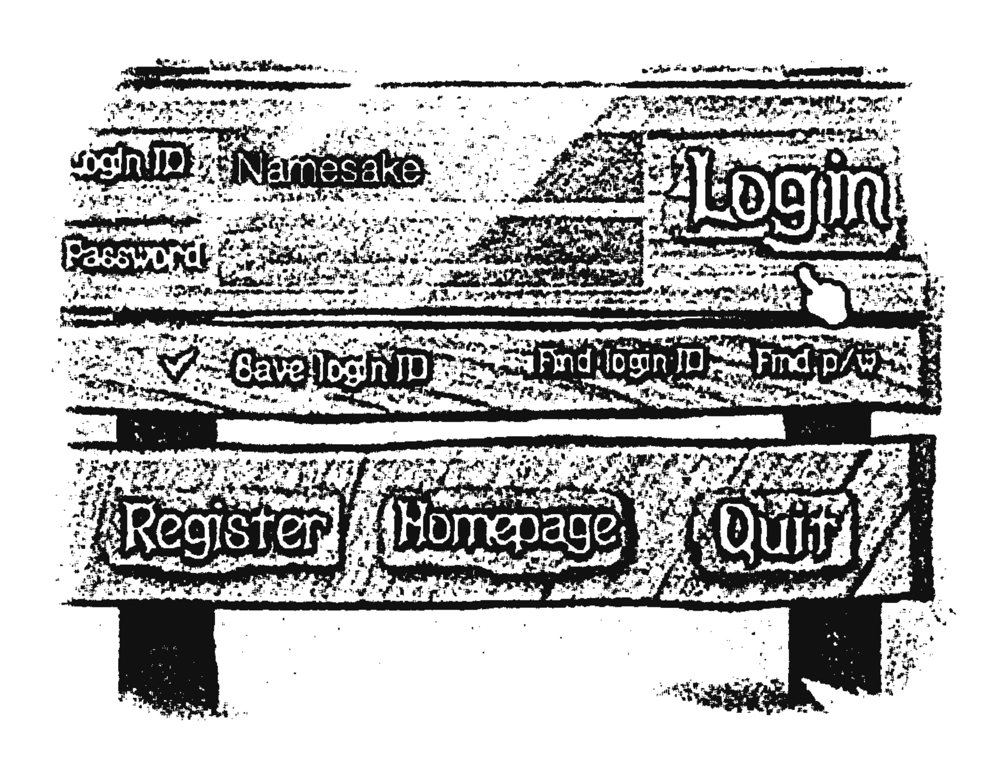

Names are a foundational part of one’s identity, but are often bestowed on us without our say; this is just the way things are. Everyone‘s relationship with their given name is different: some hold negative feelings due to gendered connotations, or since it serves as a source of social dysphoria, while others may be on their own self-discovery journeys but be completely confident in their given name, regardless of its relation to their self-expression.

The first opportunity for many people to actually choose their own name, then, is presented when they sign up for an account or start a videogame.

## “Choose your username.”

Usernames, display names, gamertags, user IDs, profile names, handles, screen names, character names, online personae: they come in many forms but all serve similar purposes. Many of us, from a young age, can probably remember the first time we had an opportunity to devise this new name for ourselves, and a select few may even still use a variation of that name to this day. For many, it also served as an opportunity to present themselves in a way they had complete control over.

Maybe it was a way to try out a new gender-affirming name, or a way to show your passion for a hobby or interest in way you hoped would point you towards community. Maybe it was an extension of your personality, or a way to make a first impression that didn’t involve your physical presence. For many, a username is just another opportunity for fun, un-serious self-expression, while for others it might be their only means of living their truest life, or a way to embody a persona that lets you indulge in a healthy level of escapism.

We asked folks for the stories behind their usernames, and the submissions we received ran the gamut from playful and easy to being integral to people’s exploration into gender and personal identity.

> My username, sisi7304, started with a childhood nickname. My younger brother was unable to say my (dead)name correctly, and instead kept calling me “sisi” (pronounced see-see) for a while. Eventually, even when my brother could pronounce my name, sisi stuck as an alias for a lot of things, particularly in online spaces. Once I turned 13, I was able to create my own official gmail, as well as associated online accounts & social media accounts. When I went to input a username, “sisi” by itself was already taken, so it suggested adding numbers to the end, where I went with “7304” from the list of suggestions. I‘m not exactly sure why I chose that string of numbers, but it has just stuck ever since. Typically, for people who only know me online, I'm called sisi. Even after I chose a new name and had it legally changed, I never changed any of my social media accounts because the nickname, sisi, fit me even more with my new name.
>
> <cite>sisi7304</cite>

> My username has gone through many iterations over the years. I think the first username I made had to do with an obsession and love for reading books as a child, and was some combination of reading + obsession followed by my birth year. I thought that was pretty lame though, so I then went through a series of usernames involving a certain basic food/fruit. I eventually also deemed that not very cool, so I needed another change. This last change was during my peak Minecraft-playing years, and there is/was a phenomenon of choosing "OG" names that were flashy, single words, and often straight from the dictionary. These were “countably finite” and therefore considered a “rare” achievement. My word was a bit of a stretch and is barely dictionary material, but it is there as an actual word if you google it. I actually fell in love with it and have used it ever since!
>
> <cite>Anonymous</cite>

> I needed a new username after transitioning. Someone said I was now “officially emma” after legally changing my name, so “officiallyemma” stuck!
>
> <cite>Emma, of <a href="https://changeyourname.mn">changeyourname.mn</a></cite>

> The name I use almost everywhere (starite) is the name of a collectible item from one of my favorite game series: Scribblenauts. I started using it in summer 2015 after I wanted to change my Minecraft username and found it on the list of names that had just been freed up by others changing theirs. I knew it was for me the moment i saw it, and I’ve been using it for over a decade! :)
>
> <cite>@starite.bsky.social</cite>

> In 2011, I received my own computer for the first time. On it, one of the first things I installed was Steam. As a kid coming from Xbox LIVE, where usernames were restrictive and cost money to change, it was culture shock getting to change my display name whenever I wanted. Playing Team Fortress 2 with friends on a server we began frequenting meant settling on usernames others could come to know us by, instead of fleeting jokes, but without concern over a username being taken (on Steam, multiple users can have the same display name because their back-end “Account ID” is what separates them from others.) Before then, usernames had always been transient and unimportant parts of my identity. I always just wanted them to be a cool word: something short and austere, or cool and mysterious. Somehow, I decided on “soymilk.” Something about the name resonated with me: it was cute, simple, and referenced a food I had started enjoying. Years went by with that username, and it was actually during this period I first started to articulate the depression and fugue I was feeling and attributing it to “gender dysphoria.” It was on that same server I met a girl who confided in me that she was a trans woman working through social transition. It was the first time I’d ever gotten to talk to someone navigating that world, and she provided me with a lot of resources and ways to do research (living in 2012 as a trans minor on the internet was a different world entirely). She came to start calling me by a diminutive, “smushed” shorthand version of soymilk, and the name stuck. I’ve been using it for well over a decade and while I don’t resonate with or rely on it as an aspect of my identity anymore, it holds a special place in my heart.
>
> <cite>@lily.museum</cite>

> I’m a trans woman who is out to her close friends and partner, but not socially to her coworkers or family. I’ve always had difficulties with self identity, or at the very least names and representations for myself. Funny enough, for my longest serving username, I needed something when making my Xbox LIVE account as a teenager and I just went to a random name generator website. I picked the first thing it gave me that sounded cute and funny. But now that I’m taking steps to make changes in my outward identity and have settled on a name I’m confident in for myself, I’m finding I can more easily come up with usernames on websites. Even if they’re just jokes or silly sometimes.
>
> <cite>Anonymous</cite>

## Usernames as self-expression

Beyond just usernames comes the opportunity for people to have full control over their self-expression online, whether it through careful curation or inventing a persona altogether. This can be a very healthy exercise and provides people with control and, sometimes even, confidence and self-esteem. It can give people an opportunity to not just try out a new name, but a way to see how it feels to be perceived by others in different lights.

Removing gender identity from the equation: it can also come as a comfort to have others know you by a self-prescribed name. During follow-up correspondence with authors of two of the previous stories, they mentioned enjoying being referred to by their usernames even after meeting up with long time online friends, or after learning each others’ given or preferred names.

It’s easy to say “it’s more important now than ever, because of how bad things are right now…” about many things, but now, as many aspects of people’s identities are being investigated or used to surveil and control, and as companies are taking away opportunities to build community in online spaces without forfeiting personal privacy and freedom, it is of the utmost importance we find ways to be confident through self-expression., and usernames serve as risk and commitment-free opportunities to express yourself however you want.

## A living project

If you feel inspired to tell your own story after reading this, we encourage you to [drop Lily a line](mailto:lily@namesake.fyi) with your story and how you'd like to be credited! We'd love to keep adding to this as time goes on.
